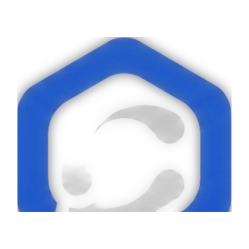

# CentralByte

<p align="center">
  
</p>

Pele desktop ([Tauri 2](https://tauri.app)) sobre CLIs de agentes já instalados na máquina — Claude, Codex, Cursor Agent e um provider `fixture` para desenvolvimento.

O harness (auth, tools, MCP, histórico da conversa) continua no binário do vendor. Esta app **detecta, lança, mostra e devolve input**: uma tab de agente = um processo de SO a correr o TUI num PTY. Sem `claude -p` nem `codex exec --json` como caminho de sessão.

| | |
|---|---|
| **Plataformas** | Linux, macOS, Windows |
| **Stack** | React 19 · Rust · Tauri 2 |
| **Licença** | [Apache-2.0](LICENSE) |

## Propósito

- Agrupar agentes por pasta / sessão na mesma janela.
- Duas vistas do mesmo PTY: **CLI** (terminal nativo) e **Chrome** (compositor da pele).
- Ferramentas de sessão (ficheiros, canvas, terminal extra, git, navegador embutido) sem orquestrar modelos entre si.
- Auth e API keys ficam no CLI do vendor — a app não pede nem guarda chaves.

Não é um control plane, gateway TEAM nem substituto do histórico do CLI. Workspace = `cwd` do processo.

## Requisitos

- [Node.js](https://nodejs.org/) 22+
- [Rust](https://rustup.rs/) (stable)
- Um ou mais CLIs no `PATH` (`claude`, `codex`, `cursor-agent`). Sem nenhum, use o provider **fixture** (eco no PTY).

### Linux (dev)

Pacotes típicos (Debian/Ubuntu):

```bash
sudo apt-get install -y \
  libwebkit2gtk-4.1-dev libgtk-3-dev libayatana-appindicator3-dev \
  librsvg2-dev libsoup-3.0-dev libvte-2.91-dev \
  build-essential pkg-config patchelf
```

No Fedora/RHEL o equivalente inclui `webkit2gtk4.1-devel`, `gtk3-devel`, `vte291-devel`, etc.

### macOS / Windows

Seguir os [pré-requisitos Tauri](https://v2.tauri.app/start/prerequisites/). No Windows o WebView2 Evergreen costuma já estar instalado.

## Desenvolvimento

```bash
git clone https://github.com/Seth0s/Central.git
cd Central
npm install
npx tauri dev
```

Gates locais (por camada):

```bash
npx tsc --noEmit          # tipos
npm test                  # vitest
npm run build             # frontend

cargo test --manifest-path crates/core/Cargo.toml   # domínio (sem GTK)
cargo test --manifest-path src-tauri/Cargo.toml     # lib Tauri (+ WebKit no Linux)
```

### Terminal nativo (Linux)

| Variável | Efeito |
|---|---|
| `CENTRALBYTE_TERM=vte\|xterm` | força o backend (omissa: VTE no Linux, xterm noutros SO) |
| `CENTRALBYTE_TERM_STATS=1` | instrumentação NDJSON (não escreve em stdout) |

## Uso rápido

1. Abrir um workspace (pasta do projeto).
2. Criar uma sessão e adicionar um agente (Claude / Codex / Cursor / fixture).
3. Alternar **CLI | Chrome** no cabeçalho do painel.
4. Slash commands são os do vendor (`/model`, `/resume`, …) — a pele escreve-os no TUI.

Documentação interna:

- [Arquitetura](docs/architecture.md)
- [ADR-001 — pele sobre PTY](docs/adr/ADR-001-pty-skin.md)
- [ADR-002 — navegador embutido](docs/adr/ADR-002-embedded-browser.md)

## Releases

Binários por tag `v*` (GitHub Actions): Windows (`.msi` / NSIS), macOS (`.dmg`, Apple Silicon + Intel), Linux (`.rpm`, `.deb`, `.AppImage`).

```bash
# alinhar versão em package.json, src-tauri/tauri.conf.json e Cargo.toml
git tag v0.1.0
git push origin v0.1.0
```

A Action cria uma **Release draft** com os artefactos. Ver [Releases](https://github.com/Seth0s/Central/releases).

No GitHub, confirme **Settings → Actions → General → Workflow permissions → Read and write permissions** — sem isso o upload falha com `Resource not accessible by integration`.

## Estrutura

```
crates/core/     domínio testável (providers, workspace, histórico SQLite)
src-tauri/       PTY, IPC, VTE (Linux), webview filho do browser
src/             chrome React (grelha, sessões, ferramentas)
prototype/       spec viva da UI (não entra no bundle)
docs/            arquitectura e ADRs
```

## Licença

Copyright 2026 [Lucas Sabino](https://github.com/Seth0s).

Licensed under the [Apache License 2.0](LICENSE). See [NOTICE](NOTICE) for attribution.
